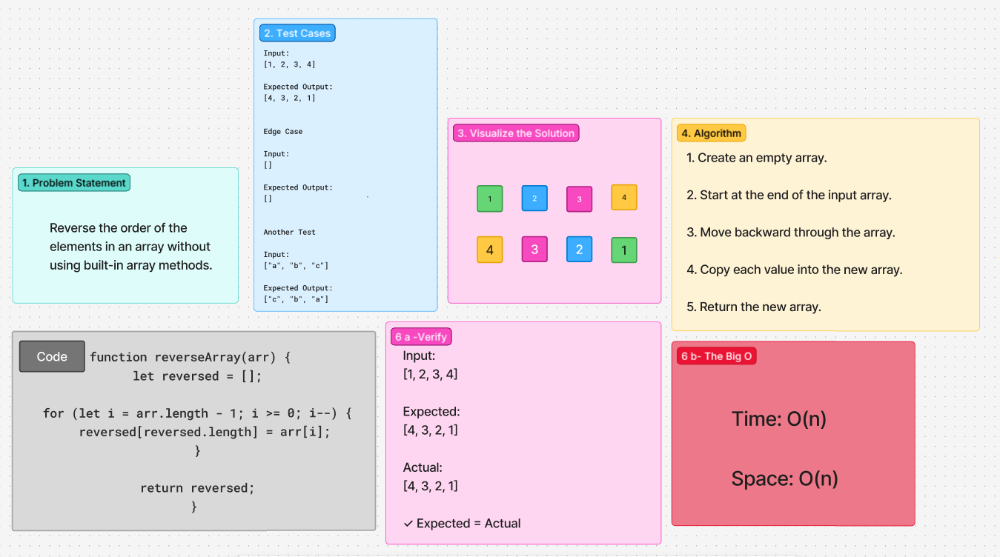

# Code Challenge 1: Reverse an Array

## Challenge / Description

Write a function called `reverseArray` that accepts an array as an argument and returns an array containing the same elements in reverse order.

Do not use built-in array methods such as `reverse()`.

### Example

**Input:**

```js
[1, 2, 3, 4]
```

**Output:**

```js
[4, 3, 2, 1]
```

## Whiteboard Process



[Figma whiteboard](https://www.figma.com/board/8nkh7lSBvRvcGbnmWtEuIX/Array-Reverse-Whiteboard?node-id=0-1&t=yL3XS4sVvqs7b6uZ-1)

## Approach & Efficiency

Start at the final index of the input array and move backward toward index 0.

During each loop iteration, copy the current element into a new output array. When the loop reaches the beginning of the input array, return the completed output array.

This approach does not use the built-in `reverse()` method and does not modify the original input array.

- **Time complexity:** O(n) because every element in the input array is visited once.
- **Space complexity:** O(n) because a new array is created containing the same number of elements as the input array.

## Solution

The completed algorithm, pseudocode, JavaScript function, and example walkthrough are shown in the whiteboard above.

The function should produce results such as:

```js
reverseArray([1, 2, 3, 4]);
// [4, 3, 2, 1]

reverseArray(["a", "b", "c"]);
// ["c", "b", "a"]

reverseArray([]);
// []
```
